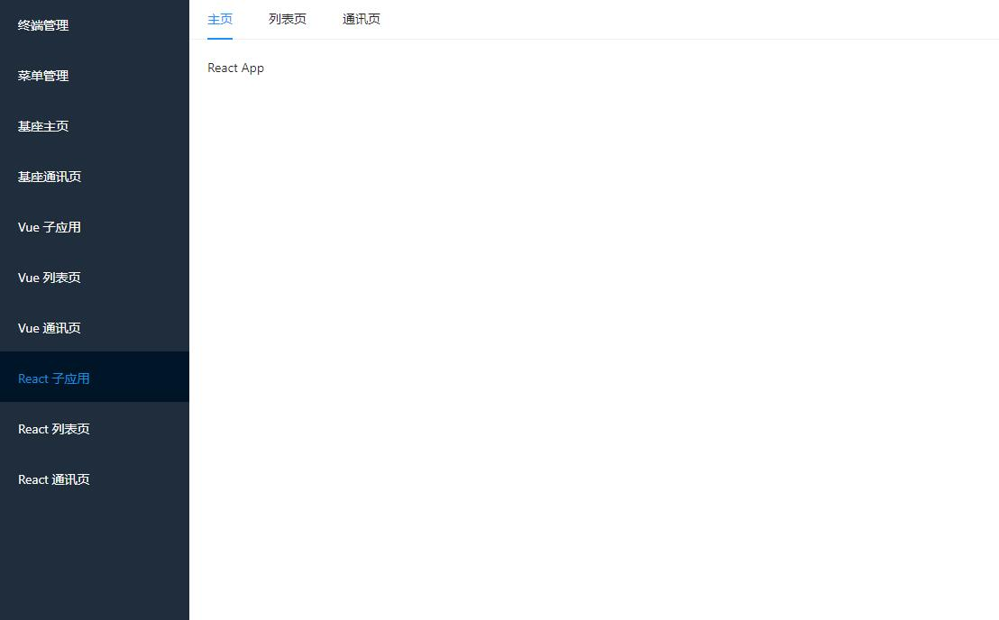

### 同时运行多个子应用

```javascript
npm run serve  // 基于npm-run-all命令
```


### 运行主应用 ```qiankun-base```

```javascript
cd qiankun-base
npm install
npm run serve
```


### 运行子应用 ```qiankun-vue```

```javascript
cd qiankun-vue
npm install
npm run serve
```


### 运行子应用 ```qiankun-react```

```
cd qiankun-react
npm install
npm run serve
```


## 效果展示



